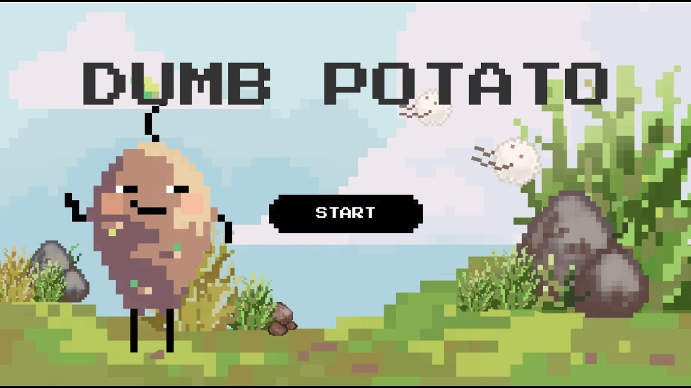

# DumbPotato

Dumb Potato is a single-player runner game developed in Java.
You play as a potato trying to survive in a world filled with deadly monsters!

## 🥔 Gameplay Overview
- Your health (HP) continuously decreases over time.

- Collect hearts to regain HP.

- Avoid monsters to stay alive.

- The goal is simple: survive as long as you can!

This project is a part of Programming Methodology 2110215 (1/2022).

See more explanation from the video: https://youtu.be/N-_pijR8wEc
